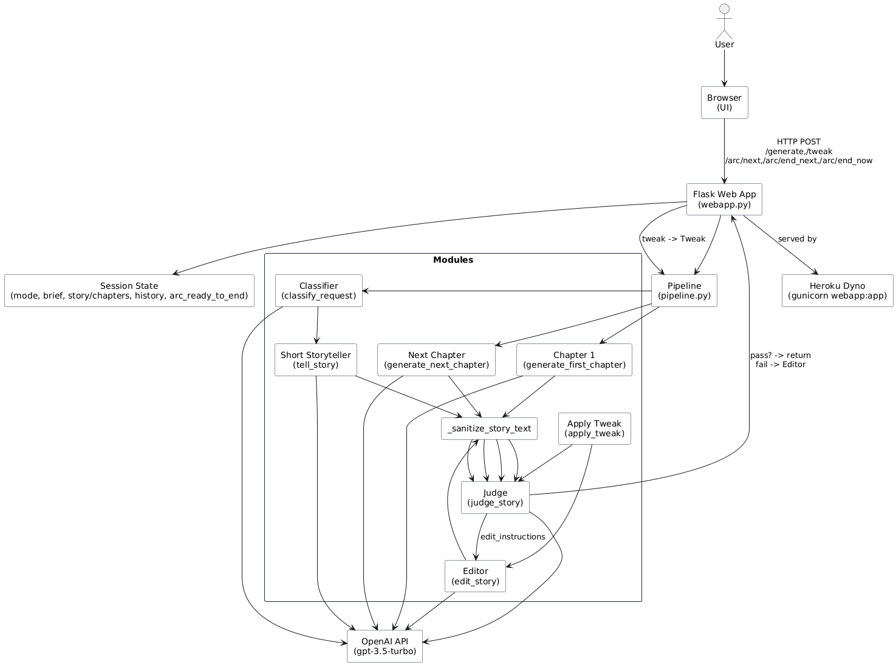

# Hippocratic AI — Bedtime Story Generator

An interactive web app that generates bedtime stories for children (ages 5–10) using OpenAI's GPT models.  
Supports **short stories** or **multi-arc stories** with user-directed tweaks between chapters.



## Features

- **Short Story Mode**: Generates a complete story in one go.
- **Multi-Arc Mode**: Generates stories chapter-by-chapter, with options to continue, end in next chapter, or end now.
- **Tweak Support**: Apply changes to the story at any time.
- **Clean Output**: Titles and story text are stripped of markdown formatting.
- **Loading Feedback**: Spinner overlay while generating content.
- **Hosted on Heroku**: [Live Demo](https://hippocratic-takehome-3de9c586b201.herokuapp.com)

## Tech Stack

- **Frontend**: HTML, CSS, JavaScript (Flask templates)
- **Backend**: Python (Flask)
- **LLM**: OpenAI `gpt-3.5-turbo`
- **Hosting**: Heroku (Gunicorn)

---

## Running Locally

To test the project locally, follow these steps:

1. **Clone the repository**

   ```
   git clone <repo-url>
   cd AI Agent Deployment Engineer Takehome
   ```

2. **Install dependencies**

   ```
   pip install -r requirements.txt
   ```

3. **Add your OpenAI API key**  
   Create a `.env` file in the project root with the following content:

   ```
   OPENAI_API_KEY=your-openai-key-here
   SECRET_KEY=your-secret-key-here
   ```

   Replace `your-openai-key-here` with your actual OpenAI API key.

4. **Run the Flask app**

   ```
   flask --app webapp run
   ```

   or

   ```
   python webapp.py
   ```

5. **Open your browser**  
   Visit [http://localhost:5000](http://localhost:5000) to use the story generator.

**Note:**  
The OpenAI API key is required for story generation. If you do not have one, you can sign up at [OpenAI](https://platform.openai.com/signup) and create an API key.
